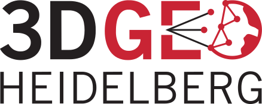
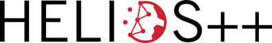
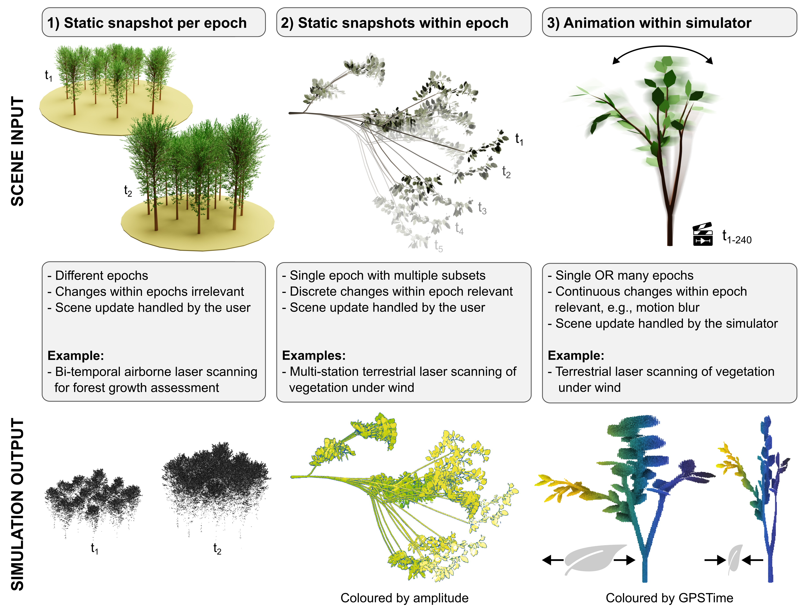
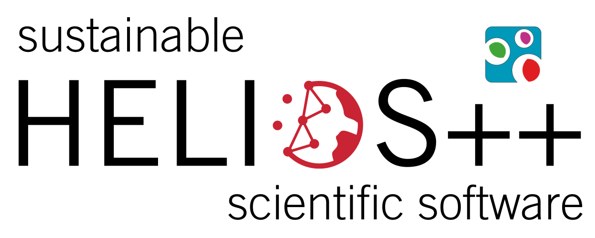
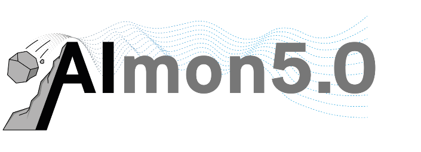

# Virtual Laser Scanning of Dynamic Scenes (VLS-4D)

Author: Hannah Weiser  
Contributors: Bernhard Höfle  
Year: 2025

---

This webpage provides an overview of the VLS-4D framework using a variety of examples from the field of vegetation monitoring, simulated with the Heidelberg LiDAR Operations Simulator [HELIOS++](https://github.com/3dgeo-heidelberg/helios).

VLS-4D refers to virtual laser scanning (VLS) of dynamic scenes. This means that instead of loading a static 3D scene and virtually scanning it in a single epoch, as done by the majority of recent studies, we work with a dynamic scene.

This opens up a range of application in the field of remote sensing of the environment.

This dynamic scene can be represented as (a) a sequence of static 3D scenes (e.g., 3D meshes), or by (b) a single 3D scene that changes during the simulation.

In the case of a sequence of static 3D scenes, each scene represents a different point in time. We can scan the different versions of the scene in multiple surveys to create multi-temporal laser scanning point clouds or point cloud time series.

In the case of a single animated 3D scene, the scene moves or deforms during the simulation, i.e., within a single epoch. In HELIOS++, object movements in the form of rigid motions (e.g., translation, rotation) are supported and can be defined via the scene XML syntax. 

These mechanisms lead to three concept of VLS-4D: The concept of static representations, the concept of many static sapshots, and the concept of animation within the simulation.

In three notebooks, we will give illustrate each concept with relevant application examples from vegetation monitoring. We provide all necessary code to reproduce the results. This way, you can learn how to use the VLS-4D framework for your own research.

Use the following links to directly access the notebooks:

1. [Static Representations](01_concept_of_static_representations/01_concept_of_static_representations.ipynb)
2. [Many Static Snapshots](02_concept_of_many_static_snapshots/02_concept_of_many_static_snapshots.ipynb)
3. [Animation within the Simulation](03_concept_of_animation_within_the_simulator/03_concept_of_animation_within_the_simulator.ipynb)

---

**Funding**:

DFG (Deutsche Forschungsgemeinschaft, German Research Foundation)

<table>
    <thead>
        <tr>
            <th></th>
            <th>Project</th>
            <th>Project number</th>
        </tr>
    </thead>
    <tbody>
        <tr>
            <td></td>
            <td><a href="https://www.geog.uni-heidelberg.de/gis/virtualearn3d_en.html">VirtuaLearn3D</a></td>
            <td>496418931</td>
        </tr>
        <tr>
            <td></td>
            <td><a href="https://www.geog.uni-heidelberg.de/gis/sustainableHELIOS_en.html">Fostering a community-driven and sustainable HELIOS++ scientific software</a></td>
            <td>528521476</td>
        </tr>
    </tbody>
</table>

 

BMBF (Bundesministerium für Bildung und Forschung, Federal Ministry of Education and Research)

<table>
    <thead>
        <tr>
            <th></th>
            <th>Project</th>
            <th>Funding code</th>
        </tr>
    </thead>
    <tbody>
        <tr>
            <td></td>
            <td>AIMON5.0</td>
            <td>02WDG1696</td>
        </tr>
    </tbody>
</table>

